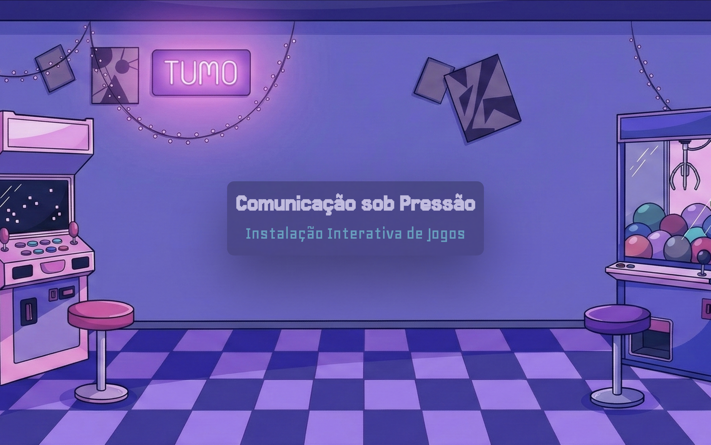
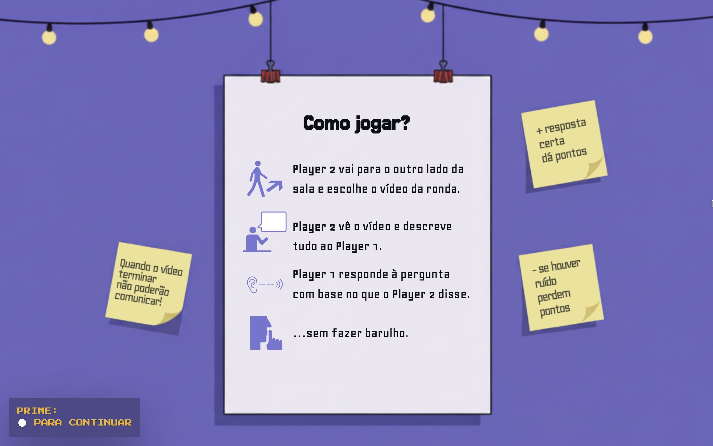
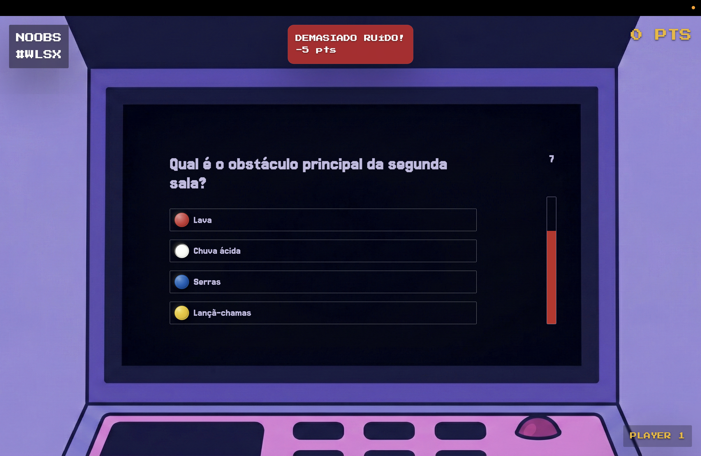
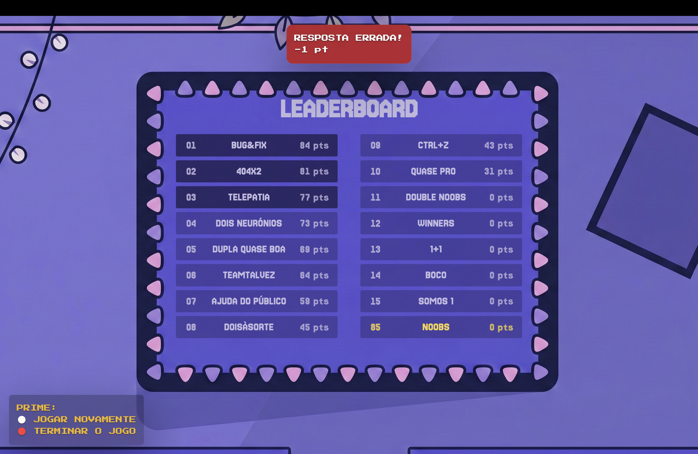

# TUMO Interactive Hub

This project was made for [TUMO Lisboa](https://tumo.pt/) HUB in Programming as part of the
[Tech & Arts Fest](https://tafest.pt/) on May 10th, 2026.

Students built a two-player browser-based installation combining custom software, student-made gameplay videos, and Arduino hardware. One screen guides the team through the game flow and quiz, while the other is used to browse, select, and watch student-made videos. A dedicated `door` interface runs as a public display with introductory, tutorial, making-of, and leaderboard screens.

## How it works

Teams are made up of two players.

One player watches a video — a demo of a game made by a TUMO student in the game development track — and describes everything they see to their partner in real time.

When the video ends, the two players can no longer communicate. The player who only listened must then answer a multiple-choice question about the video to earn points.

If they talk during the quiz, points are deducted based on the noise level detected by the microphone.

| Home screen | Tutorial screen |
| --- | --- |
|  |  |

| Quiz screen | Leaderboard screen |
| --- | --- |
|  |  |

## Architecture

The system is split into two layers:

**Core** (`src/`) — maintained by the instructor, not modified by students. Provides screen management, an alignment-based layout engine, UI component functions (`addText`, `addButton`, `addGallery`, `addQuiz`, `addVideo`, `addSoundLevel`), action handling, WebSocket sync, and Arduino serial communication.

**Student layer** (`change-me/`) — students work only here. They define one file per screen, compose UI with `add*` methods, configure layout with `setLayout()`, and wire up navigation in `change-me/app.js`. A `theme.js` file controls colors and typography.

The layout model avoids x/y coordinates — components stack vertically with alignment (`left | center | right`) and configurable gap and maxWidth. This keeps focus on structure and logic rather than positioning.

An alternative `door/` interface provides a separate public-facing display mode.

## Install

```bash
npm install
```

## Run

```bash
npm run dev
```

Interface available at `http://localhost:5173/`

Load a specific interface mode via query string:
- `http://localhost:5173/?player=1`
- `http://localhost:5173/?player=2`
- `http://localhost:5173/?interface=door`

When running across two computers, expose the app to the network:

```bash
npm run dev -- --host
```

Then use the machine's local IP:
- `http://<local-ip>:5173/?player=1`
- `http://<local-ip>:5173/?player=2`

To run both the app (with `--host`) and the sync server together:

```bash
npm run dev:host:sync
```

## Assets

Put videos in `assets/videos/` and matching thumbnails in `assets/thumbnails/`.

If a gallery screen does not receive items, it auto-loads all videos from `assets/videos/` and matches thumbnails by filename (same base name).

Video files are excluded from version control (see `.gitignore`).
